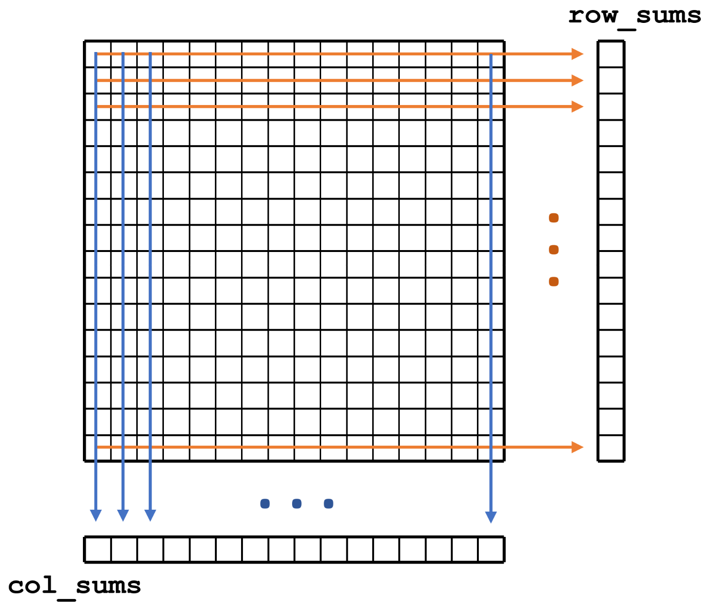
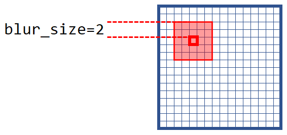

Multidimensional kernels
========================


Task 0: Update git repository, access Karolina GPU node
-------------------------------------------------------

Update the repository on the **Karolina** cluster, go to directory `09_multidim_kernel`.

Reservation is set up for the exercise, to access the GPU node, use
```
qsub -q R1078928 -A DD-21-23 -I
```

Later at home, use e.g.
```
qsub -q qnvidia -A DD-21-23 -l walltime=4:00:00 -I
```

Load the CUDA module
```
ml CUDA
```


Task 1: Matrix scale
--------------------

### Task 3.1: Matrix scale

Implement a matrix scale operation (`A = c * A`) in CUDA using two-dimensional grid and blocks. Use row-major order to store the matrix in memory. Allocate separate buffers in host and device memory and transfer the data explicitly using `cudaMemcpy()`. Make sure the program works with any sensible matrix size. Mind the maximum number of threads per block, 1024. Use the `mscale_base.cu` file as a base.

### Task 3.2: Pitched memory

Copy and modify the previous program such that it uses `cudaMallocPitch()` to allocate device memory which is properly aligned for work with matrices. Modify the kernel and other code accordingly. Use `cudaMemcpy2D()` for host <-> device data transfers. Think about the difference between number of columns, width, pitch and leading dimension.


Task 2: Events and timing
-------------------------

Extend the functionality of the matrix scale program. Using CUDA events, measure and print the time it takes to execute the GPU kernel. Use `cudaEvent_t`, `cudaEventCreate()`, `cudaEventDestroy()`, `cudaEventRecord()`, `cudaEventElapsedTime()`. Increase the size of the matrix to see the change in execution time.


Task 3: Matrix sum
------------------

Work with the `matrix_sum.cu` file. Allocate memory on the GPU for a square *unsigned integer* matrix using `cudaMallocPitch`. Write a 2D kernel that initializes the matrix with values with `A[row,col] = 2 * row + col`. 
Write a 1D kernel, in which each thread is assigned a single row and calculates a sum of all elements in that row using a simple loop. 
Write a similar kernel, but calculate the sums in each column. Store the results in separate device-memory arrays.
Launch all three kernels right after each other without any synchronization. Copy the results to the host and check for correctness. Compile and run (and debug :) ).

Then, extend the program such that it measures the execution time of all three kernels. Why is the calculation of the sum in each row so much slower?

Bonus: replace the aligned memory allocation `cudaMallocPitch` with classic unaligned `cudaMalloc` (or just use leading dimension = number of columns) and observe the performance difference.




Task 4: Image blur
------------------

In the `image_blur.cu` file, implement and launch a kernel that will blur an input image, saving the result to a different output image. The new pixel value is calculated as the average of the pixels in a suqare of radius `blur_size` surrounding it.

The image is in grayscale and uses `unsigned char` datatype to store the values, and row-major order is used. There is no actual image, just some pattern that is easy to check for correctness (to avoid the added complexity of loading and saving an actual image).




Task 5: Image to grayscale
--------------------------

In the `image_to_grayscale.cu` file, implement a kernel that converts a color image to a grayscale image. Use the formula

$gray = 0.21 r + 0.72 g + 0.07 b$

for color to grayscale conversion.

Again, the used datatype is `unsigned char`, row-major order is used, and there is no actual image. The data layout of the color image array is RGBRGBRGB...
(a.k.a. array of structures, AoS). Think about what is wrong with this layout.


