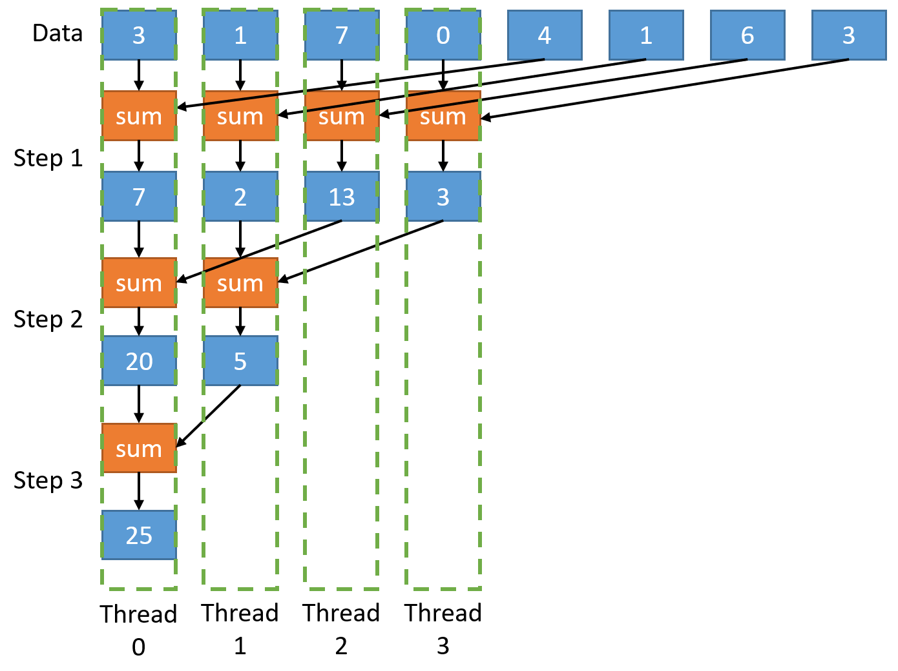
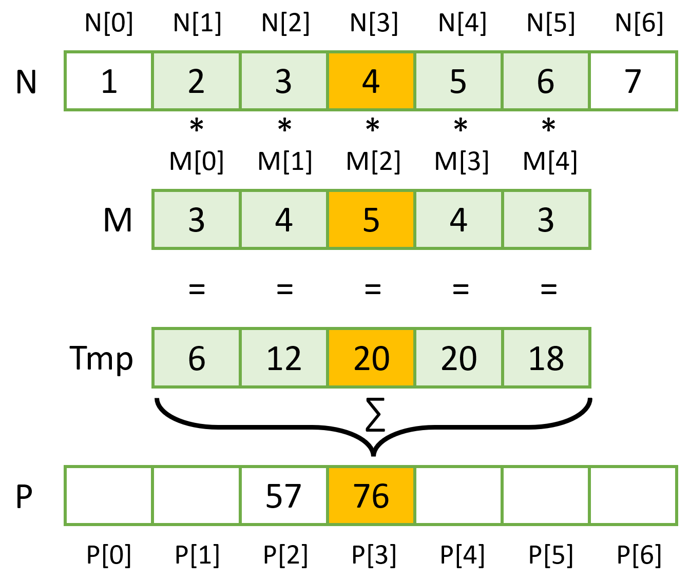

Shared memory
=============


Task 0: Update git repository, access Karolina GPU node
-------------------------------------------------------

Update the repository on the **Karolina** cluster, go to directory `10_shared_memory`.

Reservation is set up for the exercise, to access the GPU node, use
```
qsub -q R1078929 -A DD-21-23 -I
```

Later at home, use e.g.
```
qsub -q qnvidia -A DD-21-23 -l walltime=4:00:00 -I
```

Load the CUDA module
```
ml CUDA
```


Task 1: Reduction in shared memory
----------------------------------

### Task 1.1 Reduction

In the `reduction.cu` file, implement a kernel performing a sum reduction of an array of 64-bit unsigned integers. Sum the values within a block using shared memory, then add the block-wide result to the global result using atomic operations. Launch approx. as many threads as there are elements in the input array. Use the `TPB` macro as the number of threads per block.



### Task 1.2 Dynamic shared memory

Modify the program such that you do not need the `TPB` macro to specify the shared memory size at compile time. Specify the shared memory size at runtime (by a third parameter in `<<<>>>`) and use dynamic shared memory.

### Task 1.3 Doubles

Modify the reduction program such that `double` is used instead of `unsigned long long`. You will need to add e.g. `-arch=compute_60` or `-arch=sm_80` to the compilation line to signal the compiler on what hardware architecture the code will run (to guarantee that 64-bit floating-point atomics are supported).


Task 2: stencil, 1D convolution
-------------------------------

### Task 2.1 Base case

In the `convolution_1d.cu` file, implement a 1D convolution, as shown in the image below and discussed in the lecture. Don't forget about boundary edge-cases. Measure the execution time of the kernel using the provided macro `CUDAMEASURE`.

### Task 2.2 Shared memory and tiling

Write a kernel doing the same thing, but utilize tiling and shared memory to increase data reuse, thus improving performance. Measure the kernel execution time and compare it with the original version.

Bonus: don't use the `TILE_SIZE` and `MASK_RADIUS` macros for the size of shared memory, but use dynamically allocated shared memory instead (specify the shared memory size at runtime instead of compile time).


